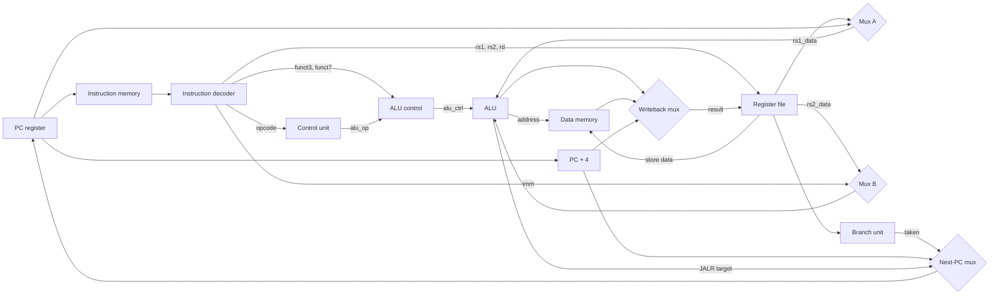

# RISC-V CPU in Verilog

A single-cycle **RV32I** processor written from scratch in Verilog, built as the first step toward a 5-stage pipelined CPU.

- 31 base instructions across all six formats (R, I, S, B, U, J)
- Modular datapath of 10 components
- Verified in simulation with Icarus Verilog and GTKWave

## Datapath

Every instruction completes in one clock cycle. The control unit decodes the opcode into datapath control signals, the ALU control combines those with `funct3`/`funct7` to select the ALU operation, and the branch unit decides whether a branch is taken.

## Supported instructions

| Type | Instructions |
|---|---|
| R-type | `add` `sub` `and` `or` `xor` `sll` `srl` `sra` `slt` `sltu` |
| I-type ALU | `addi` `andi` `ori` `xori` `slli` `srli` `srai` `slti` `sltiu` |
| Load / store | `lw` `sw` |
| Branch | `beq` `bne` `blt` `bge` `bltu` `bgeu` |
| Jump | `jal` `jalr` |
| Upper immediate | `lui` `auipc` |

Not implemented: byte/halfword memory access (`lb` `lh` `lbu` `lhu` `sb` `sh`), `fence`, `ecall`, `ebreak`.

## Modules

| File | Description |
|---|---|
| `cpu.v` | Top level: connects all modules, plus the ALU-input, writeback and next-PC muxes |
| `instruction_fetch.v` | PC register (synchronous reset), PC+4 incrementer, instruction memory (64 words) |
| `instruction_decoder.v` | Extracts instruction fields and builds the sign-extended immediate for every format |
| `control_unit.v` | Main decoder: opcode → 9 control signals |
| `alu_control.v` | `alu_op` + `funct3` + `funct7[5]` → 4-bit ALU operation (distinguishes `sub` from `addi` with a negative immediate) |
| `alu.v` | 10 operations, including signed/unsigned compare and arithmetic shift |
| `register_file.v`, `register.v` | 32 × 32-bit registers, 2 read ports, 1 write port, x0 hardwired to zero |
| `branch_unit.v` | Evaluates all six branch conditions (signed and unsigned) |
| `data_memory.v` | 64-word memory, synchronous write, combinational read |

## Verification

Each module was tested on its own in simulation, then the full CPU was tested with assembly programs covering arithmetic and logic, loads and stores, loops and all branch types, and function calls with `jal`/`jalr`.

